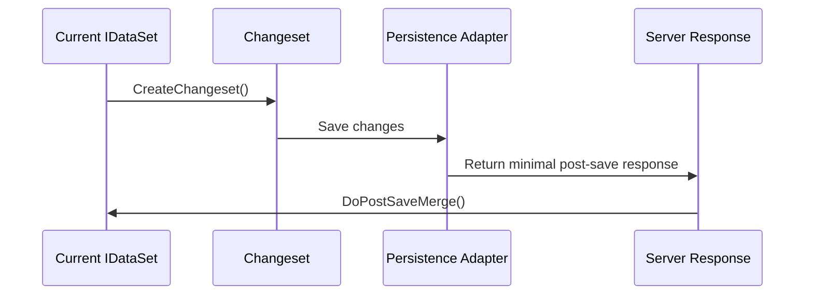

# Merge Semantics

## Explicit merge methods

The current design uses explicit merge methods instead of one ambiguous `MergeWith` entry point.

| Method | Intent |
|---|---|
| `DoPostSaveMerge` | Reconcile the current dataset after save using a server response/changeset response. |
| `DoRefreshMergeIfNoChangesExist` | Refresh from server only when local changes do not exist. |
| `DoRefreshMergePreservingLocalChanges` | Refresh server values while preserving local pending changes. |
| `DoReplaceMerge` | Replace current content from refreshed data. |

`MergeWith` remains only as obsolete compatibility routing.

## Conceptual workflow



## Replace semantics

`DoReplaceMerge` means current data should be replaced by refreshed data. It must still preserve dataset structural correctness, including schema and relations.

## Refresh preserving local changes

This mode is the safest default for UI scenarios where a user may have pending edits. Server refresh should not silently overwrite local changes.

## Refresh if no changes exist

This mode is stricter. It should avoid refresh when local changes exist.

## Post-save merge

This mode reconciles after persistence. It is especially important for:

```text
server-assigned primary keys
rowversion/concurrency fields
server defaults
client-created rows correlated by __ClientKey
```

## Maintainer rule

Do not add another generic merge mode without documenting:

1. what happens to Added rows,
2. what happens to Modified rows,
3. what happens to Deleted rows,
4. what happens to Unchanged rows,
5. whether local changes can be overwritten,
6. whether relations and schema are preserved.
