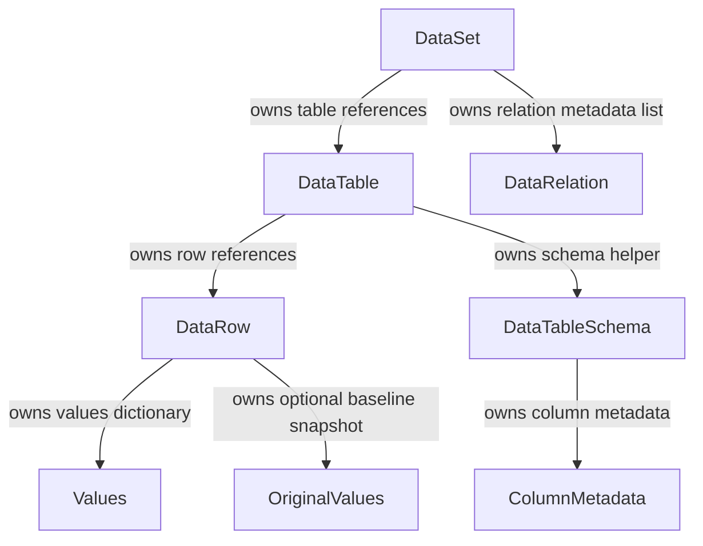

# Object Graph

## Core graph



## Important non-edges

These absent references are just as important as the present references:

```text
DataRow does not reference DataTable.
DataTable does not reference DataSet.
DataRelation does not reference DataTable objects.
DataRelation references table and column names only.
```

These non-edges reduce memory-retention risk and make serialization simpler.

## Serialization helper graph

`DataSet.Tables` is exposed as `IReadOnlyDictionary<string, IDataTable>` and ignored by JSON. Concrete `DataSet.TablesJson` is used as the JSON bridge.

`DataRow.Values` is exposed as read-only dictionary and ignored by JSON. Concrete `DataRow.ValuesJson` is used as the JSON bridge.

`DataRow.OriginalValues` follows the same pattern via `OriginalValuesJson`.
