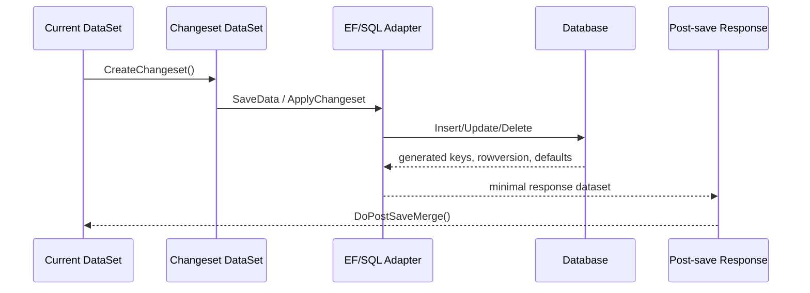

# Changeset and Post-Save Merge Diagram

```mermaid
sequenceDiagram
    participant UI as Current DataSet
    participant CS as Changeset DataSet
    participant Adapter as EF/SQL Adapter
    participant DB as Database
    participant Response as Post-save Response

    UI->>CS: CreateChangeset()
    CS->>Adapter: SaveData / ApplyChangeset
    Adapter->>DB: Insert/Update/Delete
    DB-->>Adapter: generated keys, rowversion, defaults
    Adapter-->>Response: minimal response dataset
    Response-->>UI: DoPostSaveMerge()
```
