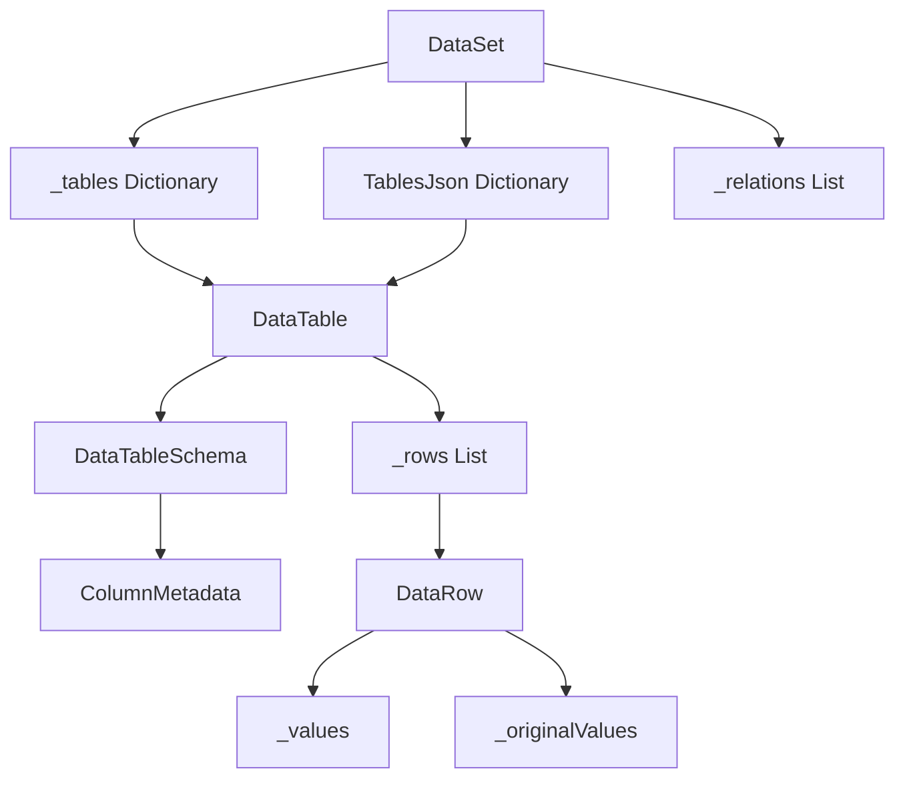

# Core Object Graph Diagram

```mermaid
graph TD
    DS[DataSet]
    DSDict[_tables Dictionary]
    DSJson[TablesJson Dictionary]
    Rel[_relations List]
    DT[DataTable]
    Schema[DataTableSchema]
    Cols[ColumnMetadata]
    Rows[_rows List]
    Row[DataRow]
    Values[_values]
    Original[_originalValues]

    DS --> DSDict
    DS --> DSJson
    DS --> Rel
    DSDict --> DT
    DSJson --> DT
    DT --> Schema
    Schema --> Cols
    DT --> Rows
    Rows --> Row
    Row --> Values
    Row --> Original
```
