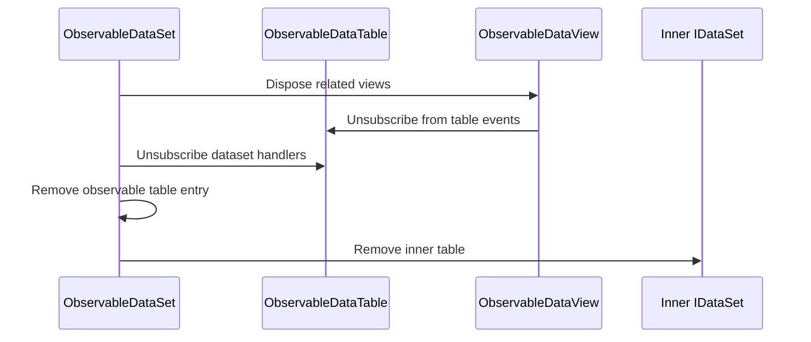

# Observable Cleanup Diagram

```mermaid
sequenceDiagram
    participant ODS as ObservableDataSet
    participant ODT as ObservableDataTable
    participant View as ObservableDataView
    participant IDS as Inner IDataSet

    ODS->>View: Dispose related views
    View->>ODT: Unsubscribe from table events
    ODS->>ODT: Unsubscribe dataset handlers
    ODS->>ODS: Remove observable table entry
    ODS->>IDS: Remove inner table
```
