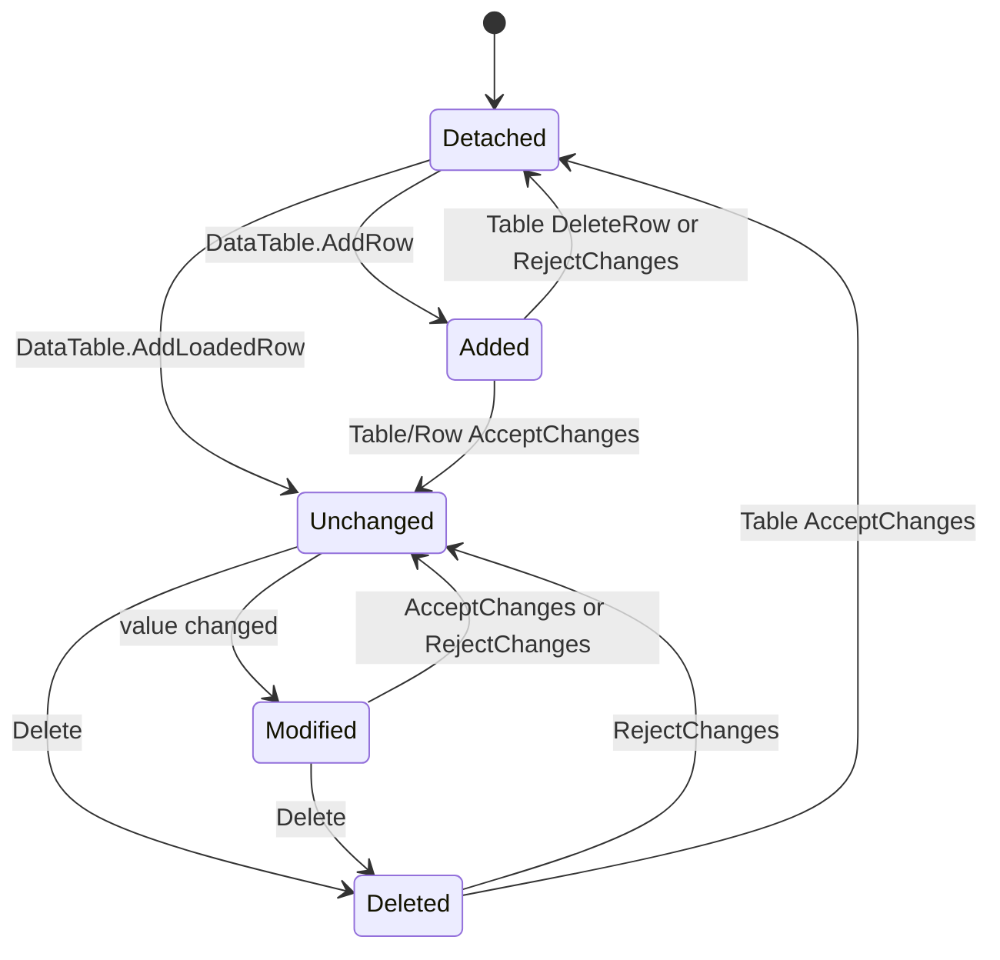

# Row Lifecycle Diagram

```mermaid
stateDiagram-v2
    [*] --> Detached
    Detached --> Added: DataTable.AddRow
    Detached --> Unchanged: DataTable.AddLoadedRow
    Added --> Unchanged: Table/Row AcceptChanges
    Added --> Detached: Table DeleteRow or RejectChanges
    Unchanged --> Modified: value changed
    Modified --> Unchanged: AcceptChanges or RejectChanges
    Unchanged --> Deleted: Delete
    Modified --> Deleted: Delete
    Deleted --> Unchanged: RejectChanges
    Deleted --> Detached: Table AcceptChanges
```
